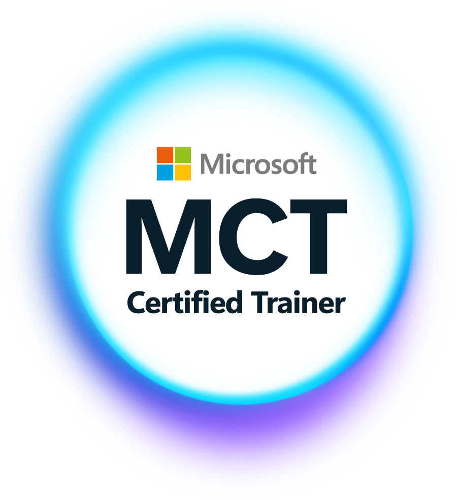

<h1 align="center">Olá, eu sou o Leandro Castor 👋</h1>

  

  <b>Microsoft MVP | Microsoft Certified Trainer (MCT) | Cloud & Security Specialist</b> 
  Especialista em Azure, Microsoft 365, Identity, Security, Governance e Infrastructure

  
  
  
  
  

  
  

  <i>💡 "Entre subir recursos e construir soluções existe arquitetura."</i>

---

## 🚀 Sobre mim

- 🎯 Atuo com **Cloud Pre-Sales, arquitetura, segurança, governança e modernização**
- 🏅 Hoje sou **Microsoft MVP** e **Microsoft Certified Trainer (MCT)**
- ☁️ Especialista em **Microsoft Azure**, **Microsoft 365** e cenários híbridos
- 🔐 Foco em **Identity, Zero Trust, Defender, Intune, Entra ID e infraestrutura segura**
- ⚙️ Trabalho com **automação, DevOps, CI/CD e Infrastructure as Code** usando PowerShell, Bicep, Terraform e Azure DevOps
- 📚 Também compartilho conhecimento por meio de treinamentos, laboratório prático, conteúdo técnico e comunidade

---

## ✨ Destaques atuais

<table align="center">
  <tr>
    <td valign="middle">
      
    </td>
    <td valign="middle">
      
    </td>
  </tr>
</table>

  <b>Áreas de atuação:</b> Azure • Microsoft 365 • Identity • Security • Governance • Automation

---

## 🧩 Projetos públicos em destaque

| Projeto | Descrição |
|---|---|
| [devops101](https://github.com/leandrocastor/devops101) | Repositório voltado a estudos e práticas de DevOps. |
| [scaleazuresqldatabase](https://github.com/leandrocastor/scaleazuresqldatabase) | Automação para escala de Azure SQL Database. |
| [mslearn-deploy-run-container-app-service](https://github.com/leandrocastor/mslearn-deploy-run-container-app-service) | Exemplo prático do Microsoft Learn para deploy de aplicação em container no App Service. |
| [glpi-singlesignon](https://github.com/leandrocastor/glpi-singlesignon) | Integração de autenticação do GLPI com Microsoft 365 / Office 365. |
| [AZ-104-MicrosoftAzureAdministrator-master](https://github.com/leandrocastor/AZ-104-MicrosoftAzureAdministrator-master) | Material de apoio e laboratório para Azure Administrator. |

---

## 🎓 Treinamentos Oficiais Microsoft

> Como **Microsoft Certified Trainer (MCT)**, ministro treinamentos oficiais focados em certificação e aplicação prática.

| Curso | Título | Nível |
|:---:|---|:---:|
| **AZ-900** | Microsoft Azure Fundamentals | Fundamentals |
| **AZ-104** | Microsoft Azure Administrator | Associate |
| **AZ-305** | Designing Microsoft Azure Infrastructure Solutions | Expert |
| **AZ-500** | Microsoft Azure Security Technologies | Associate |

---

## 🏅 Certificações em destaque

### Microsoft
<table align="center">
  <tr>
    <td valign="middle">
      
    </td>
    <td valign="middle">
      
    </td>
    <td valign="middle">
      
    </td>
    <td valign="middle">
      
    </td>
    <td valign="middle">
      
    </td>
    <td valign="middle">
      
    </td>
    <td valign="middle">
      
    </td>
    <td valign="middle">
      
    </td>
  </tr>
</table>

### AWS

  

---

## 🛠️ Stack principal

**☁️ Cloud**

  
  
  

**🔐 Security & Identity**

  
  
  
  
  

**⚙️ DevOps, IaC & Automation**

  
  
  
  
  
  

---

## 📊 GitHub Stats

  
  

---

## 🐍 Contribuições

  <picture>
    <source media="(prefers-color-scheme: dark)" srcset="https://raw.githubusercontent.com/leandrocastor/leandrocastor/output/github-contribution-grid-snake-dark.svg"/>
    <source media="(prefers-color-scheme: light)" srcset="https://raw.githubusercontent.com/leandrocastor/leandrocastor/output/github-contribution-grid-snake.svg"/>
    
  </picture>

---

## 📫 Vamos nos conectar?

  
  
  
  
  

