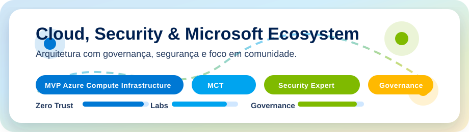
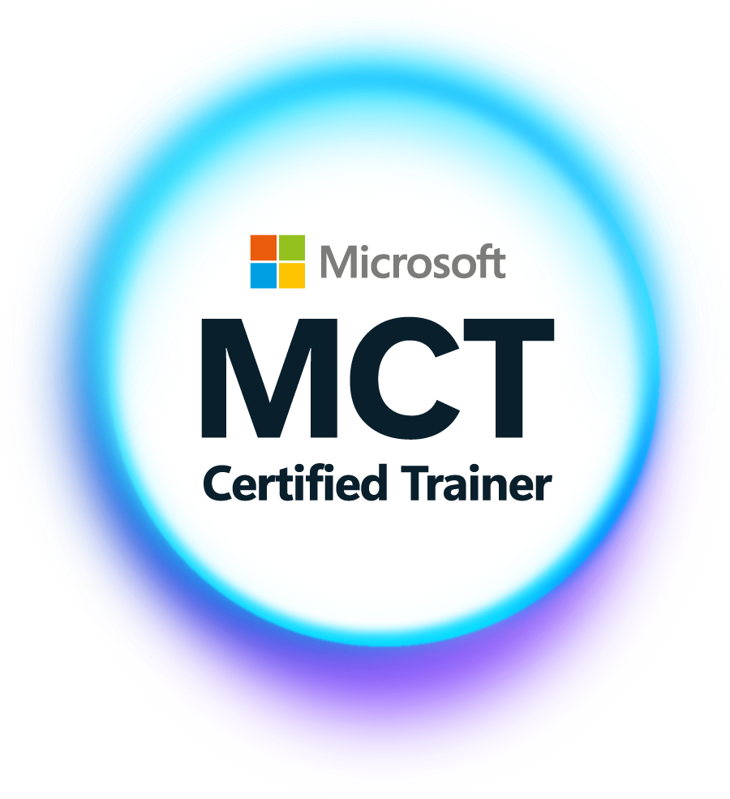

<h1 align="center">Olá, eu sou o Leandro Castor 👋</h1>

  

  <b>Microsoft MVP | Microsoft Certified Trainer (MCT) | Cloud & Security Specialist</b> 
  Especialista em Azure, Microsoft 365, Identity, Security, Governance e Infrastructure

  
  
  
  
  

  
  
  

  

  <i>💡 "Entre subir recursos e construir soluções existe arquitetura."</i>

---

## 🚀 Sobre mim

- 🎯 Atuo com **Cloud Pre-Sales, arquitetura, segurança, governança e modernização**
- 🏅 Hoje sou **Microsoft MVP** e **Microsoft Certified Trainer (MCT)**
- ☁️ Especialista em **Microsoft Azure**, **Microsoft 365** e cenários híbridos
- 🔐 Foco em **Identity, Zero Trust, Defender, Intune, Entra ID e infraestrutura segura**
- ⚙️ Trabalho com **automação, DevOps, CI/CD e Infrastructure as Code** usando PowerShell, Bicep, Terraform e Azure DevOps
- 📚 Também compartilho conhecimento por meio de treinamentos, laboratório prático, conteúdo técnico e comunidade

---

## ⚡ Quick Links

| 📖 Documentação | 🎥 Tutoriais | 💬 Comunidade | 🚀 Projetos |
|:---:|:---:|:---:|:---:|
| [Microsoft Learn](https://learn.microsoft.com/pt-br/users/leandrocastor-0289/ "Perfil Microsoft Learn") | [YouTube](https://www.youtube.com/@leandrocastor "Canal com conteúdos técnicos") | [LinkedIn](https://linkedin.com/in/leandrocastor/ "Networking e comunidade") | [Repositórios](https://github.com/leandrocastor?tab=repositories "Projetos públicos no GitHub") |
| [Credly](https://www.credly.com/users/leandro-irineu-castor/ "Certificações e badges") | [CastorTech](https://castortech.com.br "Artigos e materiais técnicos") | [GitHub Profile](https://github.com/leandrocastor "Perfil GitHub") | [castortech-site](https://github.com/leandrocastor/castortech-site "Site oficial CastorTech") |

---

## ✨ Destaques atuais

<table align="center">
  <tr>
    <td valign="middle">
      
    </td>
    <td valign="middle">
      
    </td>
  </tr>
</table>

  <b>Áreas de atuação:</b> Azure • Microsoft 365 • Identity • Security • Governance • Automation

---

## 🗺️ Jornada profissional

<table>
  <tr>
    <th>Ano</th>
    <th>Marco</th>
    <th>Impacto</th>
  </tr>
  <tr>
    <td><strong>Hoje</strong></td>
    <td>Microsoft MVP + MCT</td>
    <td>Comunidade, treinamentos oficiais e conteúdo técnico aplicado.</td>
  </tr>
  <tr>
    <td><strong>2024+</strong></td>
    <td>Cloud & Security Specialist</td>
    <td>Arquiteturas seguras, governança, identidade e modernização em Microsoft Cloud.</td>
  </tr>
  <tr>
    <td><strong>Expert</strong></td>
    <td>Azure Solutions Architect + Cybersecurity Architect</td>
    <td>Desenho de soluções escaláveis com foco em segurança, operações e valor de negócio.</td>
  </tr>
  <tr>
    <td><strong>Base</strong></td>
    <td>Infraestrutura, DevOps e automação</td>
    <td>Construção de ambientes híbridos, IaC, pipelines e operações confiáveis.</td>
  </tr>
</table>

---

## 📈 Expertise por domínio

| Domínio | Proficiência | Foco |
|---|:---:|---|
| Azure Architecture | █████████░ 90% | Landing zones, modernização, governança e Well-Architected |
| Security & Identity | █████████░ 95% | Zero Trust, Entra ID, Defender, Sentinel e compliance |
| Microsoft 365 | ████████░░ 85% | Administração, proteção, colaboração e produtividade segura |
| DevOps & IaC | ████████░░ 85% | PowerShell, Bicep, Terraform, Azure DevOps e GitHub Actions |
| Comunidade & Treinamento | █████████░ 95% | MCT, MVP, talks, labs e capacitação prática |

---

## 🔬 Testando agora / Em exploração

- [x] GitHub Copilot e engenharia de prompts para produtividade técnica
- [x] Microsoft Defender XDR, Sentinel e estratégias Zero Trust
- [ ] Microsoft Fabric para cenários de analytics e governança de dados
- [ ] Copilot Studio e automações com agentes orientados a negócio
- [ ] FinOps em Azure para otimização contínua de custos e arquitetura

---

## 🧩 Projetos públicos em destaque

| Projeto | Descrição |
|---|---|
| [castortech-site](https://github.com/leandrocastor/castortech-site) | Site oficial CastorTech: React + Vite + Azure Static Web Apps, CMS próprio para artigos HTML/Markdown, analytics com Application Insights e Clarity. |
| [devops101](https://github.com/leandrocastor/devops101) | Repositório voltado a estudos e práticas de DevOps. |
| [scaleazuresqldatabase](https://github.com/leandrocastor/scaleazuresqldatabase) | Automação para escala de Azure SQL Database. |
| [mslearn-deploy-run-container-app-service](https://github.com/leandrocastor/mslearn-deploy-run-container-app-service) | Exemplo prático do Microsoft Learn para deploy de aplicação em container no App Service. |
| [glpi-singlesignon](https://github.com/leandrocastor/glpi-singlesignon) | Integração de autenticação do GLPI com Microsoft 365 / Office 365. |

---

## 📝 Últimos posts técnicos

<!-- O workflow .github/workflows/update-dynamic-profile.yml pode atualizar esta seção automaticamente a partir de um feed RSS. -->
<!-- BLOG-POST-LIST:START -->
- [Arquitetura, segurança e Microsoft Cloud na CastorTech](https://castortech.com.br) — conteúdos técnicos, labs e reflexões sobre Cloud, Security e Modern Work.
- [Projetos e automações públicas no GitHub](https://github.com/leandrocastor?tab=repositories) — exemplos práticos em Azure, DevOps e Microsoft 365.
- [Conteúdos em vídeo no YouTube](https://www.youtube.com/@leandrocastor) — tutoriais, dicas e demonstrações técnicas.
<!-- BLOG-POST-LIST:END -->

---

## 🎓 Treinamentos Oficiais Microsoft

> Como **Microsoft Certified Trainer (MCT)**, ministro treinamentos oficiais focados em certificação e aplicação prática.

| Curso | Título | Nível |
|:---:|---|:---:|
| **AZ-900** | Microsoft Azure Fundamentals | Fundamentals |
| **AZ-104** | Microsoft Azure Administrator | Associate |
| **AZ-305** | Designing Microsoft Azure Infrastructure Solutions | Expert |
| **AZ-500** | Microsoft Azure Security Technologies | Associate |

---

## 🏅 Certificações em destaque

### Microsoft
<table align="center">
  <tr>
    <td valign="middle">
      
    </td>
    <td valign="middle">
      
    </td>
    <td valign="middle">
      
    </td>
    <td valign="middle">
      
    </td>
    <td valign="middle">
      
    </td>
    <td valign="middle">
      
    </td>
    <td valign="middle">
      
    </td>
    <td valign="middle">
      
    </td>
  </tr>
</table>

### AWS

  

---

## 🛠️ Stack principal

**☁️ Cloud**

  
  
  

**🔐 Security & Identity**

  
  
  
  
  

**⚙️ DevOps, IaC & Automation**

  
  
  
  
  
  

---

## 📊 GitHub Stats

  <picture>
    <source media="(prefers-color-scheme: dark)" srcset="https://github-profile-summary-cards.vercel.app/api/cards/stats?username=leandrocastor&theme=github_dark"/>
    <source media="(prefers-color-scheme: light)" srcset="https://github-profile-summary-cards.vercel.app/api/cards/stats?username=leandrocastor&theme=github"/>
    
  </picture>
  

  <picture>
    <source media="(prefers-color-scheme: dark)" srcset="https://github-profile-summary-cards.vercel.app/api/cards/repos-per-language?username=leandrocastor&theme=github_dark"/>
    <source media="(prefers-color-scheme: light)" srcset="https://github-profile-summary-cards.vercel.app/api/cards/repos-per-language?username=leandrocastor&theme=github"/>
    
  </picture>
  <picture>
    <source media="(prefers-color-scheme: dark)" srcset="https://github-profile-summary-cards.vercel.app/api/cards/productive-time?username=leandrocastor&theme=github_dark&utcOffset=-3"/>
    <source media="(prefers-color-scheme: light)" srcset="https://github-profile-summary-cards.vercel.app/api/cards/productive-time?username=leandrocastor&theme=github&utcOffset=-3"/>
    
  </picture>

---

## 🐍 Contribuições

  

  <picture>
    <source media="(prefers-color-scheme: dark)" srcset="https://raw.githubusercontent.com/leandrocastor/leandrocastor/output/github-contribution-grid-snake-dark.svg"/>
    <source media="(prefers-color-scheme: light)" srcset="https://raw.githubusercontent.com/leandrocastor/leandrocastor/output/github-contribution-grid-snake.svg"/>
    
  </picture>

---

## 🤖 Automações do perfil

- `Generate Snake Animation`: atualiza diariamente a animação de contribuições no branch `output`.
- `Update Dynamic Profile Sections`: preparado para atualizar a seção de posts técnicos por RSS entre `BLOG-POST-LIST:START` e `BLOG-POST-LIST:END`.
- Para manter o README atualizado, ajuste as URLs no workflow e publique novos conteúdos no feed configurado.

---

## 📫 Vamos nos conectar?

  
  
  
  
  

